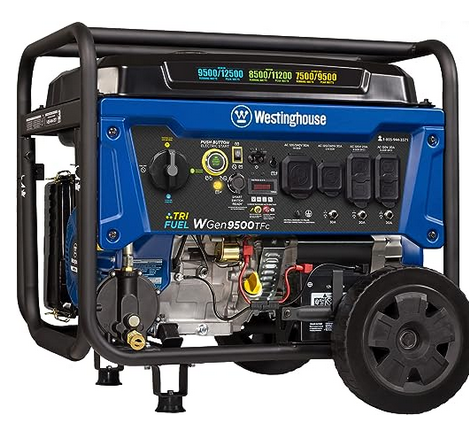
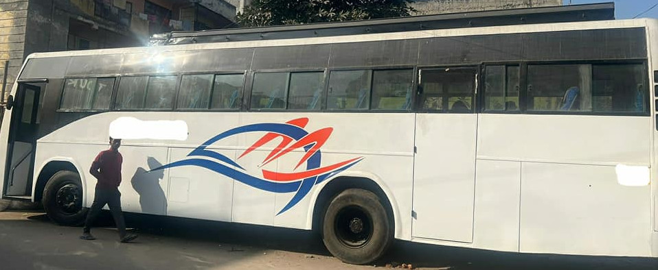

# Shatoshis

## Overview

Shatoshis is a sanitation initiative aimed at cleaning up the streets of India.
The project incentivizes people to use designated toilets by rewarding them with Bitcoin.
Human waste is then converted into methane to generate electricity for Bitcoin mining.
Profits are used to further incentivize toilet use and employ street cleaners to collect more biofuel
for electricity generation.

## Table of Contents

1. [Objective](#objective)
2. [How it Works](#how-it-works)
3. [Implementation Steps](#implementation-steps)
4. [Funding](#funding)
5. [Partnerships](#partnerships)
6. [Monitoring and Evaluation](#monitoring-and-evaluation)
7. [Contact](#contact)

## Objective

1. Improve sanitation by reducing open defecation.
2. Generate renewable energy from waste.
3. Create employment opportunities for street cleaning.

## How it Works

### Phase 1: Incentive for Toilet Use

1. Locate participating toilets.
2. Use toilet.
3. Receive Bitcoin payment in QR code form.

### Phase 2: Waste to Energy

1. Waste collected from toilets and street cleaning.
2. Convert into methane using anaerobic digester.
3. Methane converted into electricity using generator.
4. Electricity powers Bitcoin mining income.

### Phase 3: Revenue Allocation

1. Mining profits used to incentivize users.
2. Surplus used to employ street cleaners to harvest more biofuel.

## MVP

The Minimum Viable Product (MVP) will be an 18-wheeler truck or bus equipped with:

1. Toilets to collect human waste for fuel.
2. Anaerobic digesters to turn waste into methane.
3. Generators to turn methane into electricity.
4. Bitcoin miners for generating income.

This mobile unit serves as a proof of concept, demonstrating the viability of waste-to-energy conversion and Bitcoin mining.

## Implementation Steps

1. Identify suitable locations for toilets.
2. Install biofuel toilets.
3. Set up monitors and QR codes to pay users Bitcoin.
4. Launch marketing campaign.
5. Monitor usage and adjust incentives.
6. Hire street cleaners.

## Funding

1. Initial capital raise for biofuel toilets, generators and miners.
2. Ongoing operational costs.
3. Revenue generated from Bitcoin mining.

## Partnerships

1. Local municipalities for land and permits.
2. Renewable energy companies for biogas technology.
3. Platforms for Bitcoin transactions.

## Monitoring and Evaluation

1. Track number of toilet users.
2. Measure methane production.
3. Evaluate Bitcoin mining profitability.
4. Assess street cleaning initiative.

## Contact

For more information, contact `info@shits4bits.com`.\
For detailed project plans and updates, visit `shits4bits.com`.
